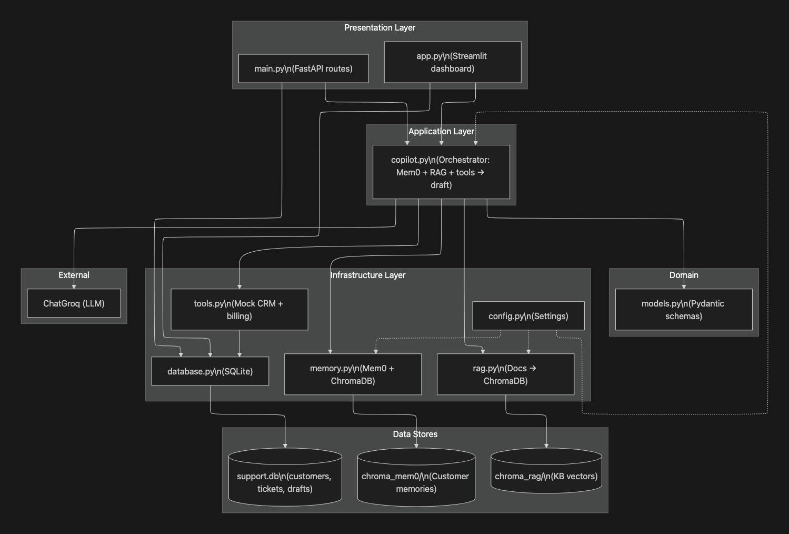
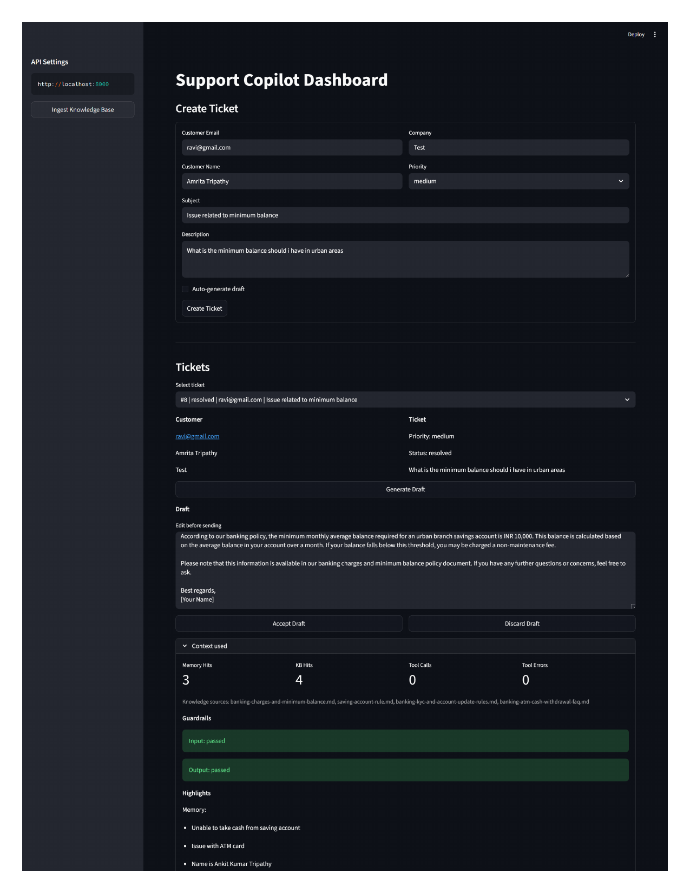

# 🤖 AI Copilot for Support Agents

<p align="center">
An AI-powered customer support copilot that helps human support agents resolve customer tickets faster using <b>LangGraph</b>, <b>LangChain</b>, <b>Groq</b>, <b>Retrieval-Augmented Generation (RAG)</b>, <b>ChromaDB</b>, and <b>Mem0</b>.
</p>

<p align="center">


</p>

---

# 📖 Overview

**AI Copilot for Support Agents** is an end-to-end **Generative AI** application that assists customer support teams by automatically generating intelligent, context-aware draft responses for customer tickets.

Instead of relying solely on an LLM, the application combines:

* 🧠 Long-term customer memory (Mem0)
* 📚 Retrieval-Augmented Generation (RAG)
* 🔧 Backend tool calling
* 🛡️ Guardrails
* ⚡ LangGraph agent orchestration

to ensure every response is:

* Accurate
* Grounded
* Personalized
* Safe
* Explainable

The generated draft is reviewed by a human support agent before being sent to the customer.

---

# 🏗️ System Architecture

<p align="center">

</p>

<p align="center">
<b>High-Level Architecture of AI Copilot</b>
</p>

The architecture consists of:

* **FastAPI** backend
* **Streamlit** dashboard
* **LangGraph** orchestration
* **Groq LLM**
* **RAG Knowledge Base**
* **Mem0 Customer Memory**
* **Backend Tools**
* **SQLite Ticket Store**
* **Guardrails**
* **Observability Layer**

---

# 📸 Dashboard Preview

<p align="center">

</p>

<p align="center">
<b>Support Copilot Dashboard</b>
</p>

The dashboard enables support agents to:

* Create support tickets
* Generate AI-powered draft replies
* Inspect retrieved knowledge chunks
* Review customer memory hits
* View backend tool outputs
* Monitor guardrail decisions
* Copy or edit the generated response before sending

---

# ✨ Key Features

## 🤖 AI Draft Generation

Generate professional customer support replies using a LangGraph-powered AI agent built on Groq LLMs.

---

## 📚 Retrieval-Augmented Generation (RAG)

The AI retrieves relevant company knowledge from ChromaDB before generating every response.

Benefits:

* Reduces hallucinations
* Produces grounded responses
* Uses internal documentation

---

## 🧠 Customer Memory

Persistent customer memory powered by **Mem0** allows the assistant to remember:

* Previous tickets
* Customer preferences
* Historical interactions
* Company-specific information

This enables personalized support experiences.

---

## 🔧 Tool Calling

The AI agent can invoke backend tools during reasoning, including:

* Account lookup
* Billing information
* Subscription status
* Risk assessment
* Customer profile retrieval

This ensures responses are based on real backend data rather than assumptions.

---

## 🛡️ AI Guardrails

Built-in guardrails provide:

* PII detection
* Toxicity filtering
* Topic restriction
* Safe fallback responses

Unsafe prompts are blocked before reaching the LLM.

---

## 📈 Observability

Every generation records:

* Prompt
* Retrieved documents
* Memory retrieval
* Tool calls
* Final response

This greatly simplifies debugging and evaluation.

---

## 📊 Evaluation Pipeline

The repository includes a complete evaluation framework for measuring AI quality using a golden dataset.

---

## 🌐 REST API

A FastAPI backend exposes endpoints for:

* Ticket Management
* Draft Generation
* Knowledge Base
* Customer Memory
* Health Checks

---

## 🎨 Interactive Dashboard

A Streamlit-based dashboard provides an intuitive interface for customer support agents.

---

# 🔄 Workflow

```text
                     Customer
                         │
                         ▼
                 Create Support Ticket
                         │
                         ▼
                 FastAPI Backend API
                         │
        ┌────────────────┼────────────────┐
        │                │                │
        ▼                ▼                ▼
 Retrieve Memory     Search RAG KB     Backend Tools
   (Mem0)            (ChromaDB)       (Billing/Profile)
        │                │                │
        └────────────────┼────────────────┘
                         ▼
                 Guardrails Validation
                         │
                         ▼
                 LangGraph Agent
                         │
                         ▼
                    Groq LLM
                         │
                         ▼
              AI Draft Response Generated
                         │
                         ▼
             Human Support Agent Review
                         │
                         ▼
                Final Response to Customer
```

---

# 🛠️ Technology Stack

| Category             | Technologies         |
| -------------------- | -------------------- |
| Programming Language | Python 3.11          |
| Backend              | FastAPI, Uvicorn     |
| Frontend             | Streamlit            |
| LLM Framework        | LangChain, LangGraph |
| LLM Provider         | Groq                 |
| Retrieval            | ChromaDB             |
| Customer Memory      | Mem0                 |
| Embeddings           | HuggingFace / Google |
| Database             | SQLite               |
| Guardrails           | guardrails-ai        |
| Configuration        | Pydantic Settings    |
| Evaluation           | ragas, deepeval      |
| Observability        | Custom Tracer        |

---

# 📂 Project Structure

```text
customer_support_agent/
│
├── api/
│   ├── app_factory.py
│   ├── dependencies.py
│   └── routers/
│
├── core/
│   └── settings.py
│
├── integrations/
│   ├── rag/
│   ├── memory/
│   └── tools/
│
├── repositories/
│   └── sqlite/
│
├── services/
│
├── schemas/
│
├── observability/
│
├── knowledge_base/
│
├── evals/
│
├── screenshots/
│
├── architecturediagram.png
├── app.py
├── main.py
├── pyproject.toml
├── docker-compose.yml
└── README.md
```
# 📡 API Overview

The FastAPI backend exposes a RESTful API that powers the Streamlit dashboard and can be integrated with external applications.

## Available Endpoints

| Method | Endpoint                                     | Description                   |
| ------ | -------------------------------------------- | ----------------------------- |
| GET    | `/health`                                    | Health check                  |
| POST   | `/api/tickets`                               | Create a support ticket       |
| GET    | `/api/tickets`                               | Retrieve all tickets          |
| GET    | `/api/tickets/{ticket_id}`                   | Retrieve a specific ticket    |
| POST   | `/api/tickets/{ticket_id}/generate-draft`    | Generate AI draft response    |
| GET    | `/api/drafts/{ticket_id}`                    | Retrieve generated draft      |
| POST   | `/api/knowledge/ingest`                      | Index documents into ChromaDB |
| GET    | `/api/customers/{customer_id}/memories`      | Retrieve customer memories    |
| GET    | `/api/customers/{customer_id}/memory-search` | Semantic memory search        |

---

# 🧠 Retrieval-Augmented Generation (RAG)

Instead of relying entirely on the LLM's internal knowledge, every customer query is grounded using an enterprise knowledge base.

## Workflow

```text
Ticket
   │
   ▼
Chunk Query
   │
   ▼
Embedding Model
   │
   ▼
ChromaDB Vector Search
   │
   ▼
Top-k Relevant Chunks
   │
   ▼
Prompt Construction
   │
   ▼
Groq LLM
```

## Benefits

* Reduces hallucinations
* Uses company documentation
* Provides factual responses
* Improves consistency
* Easily extensible knowledge base

---

# 🧠 Customer Memory (Mem0)

Customer memory enables the AI to maintain continuity across multiple conversations.

The assistant can remember:

* Previous support tickets
* Customer preferences
* Subscription history
* Account information
* Company-specific context

Example:

Customer:

> "I contacted you yesterday."

Without memory:

> "Can you explain your issue?"

With Mem0:

> "Yesterday you reported a payment issue. I can see that it has already been escalated."

---

# 🔧 Backend Tool Calling

The LangGraph agent can invoke external tools whenever additional information is required.

Example tools:

* Account Lookup
* Billing Service
* Customer Profile
* Subscription Details
* Risk Assessment
* Internal APIs

This allows the AI to generate responses based on real-time backend data.

---

# 🛡️ AI Guardrails

Before reaching the language model, every request passes through multiple safety checks.

Current guardrails include:

* Personally Identifiable Information (PII) detection
* Toxicity filtering
* Topic restriction
* Prompt validation
* Safe fallback responses

Blocked requests never reach the LLM.

---

# 📊 Observability

Every generation is logged for debugging and evaluation.

Captured information includes:

* User prompt
* Retrieved documents
* Customer memory
* Tool calls
* Final prompt
* Generated response
* Latency
* Guardrail outcomes

This makes debugging AI behavior significantly easier.

---

# 📈 Evaluation

The repository contains an evaluation framework for measuring response quality.

Included components:

* Golden Dataset
* Automated Evaluation
* Quality Reports
* RAG Evaluation
* Agent Evaluation

Run the complete evaluation suite:

```bash
uv run pytest -m full_eval
```

Generate evaluation reports:

```bash
python evals/run_eval_report.py
```

---

# 🧪 Testing

Run all tests:

```bash
uv run pytest
```

Run a specific module:

```bash
pytest tests/test_api.py
```

Generate coverage:

```bash
pytest --cov=customer_support_agent
```

---

# 📚 Knowledge Base

Knowledge documents are stored as Markdown files inside:

```text
knowledge_base/
```

Example topics:

* KYC Rules
* Savings Account
* ATM Withdrawal
* Transaction Charges
* Card Services
* Banking Policies

Adding new knowledge is as simple as placing additional Markdown files into this directory and re-running the ingestion endpoint.

---

# ⚙️ Configuration

Application settings are managed using **Pydantic Settings**.

Examples include:

* API Host
* API Port
* Chunk Size
* Chunk Overlap
* Top-k Retrieval
* Memory Retrieval Count
* Embedding Model
* LLM Model
* Guardrails Toggle
* Tracing Toggle

All configuration is centralized inside:

```text
customer_support_agent/core/settings.py
```
# 🚀 Deployment

The project can be deployed using several platforms.

## Docker

```bash
docker compose up --build
```

Services:

| Service   | Port |
| --------- | ---- |
| FastAPI   | 8000 |
| Streamlit | 8501 |

---

## Render

Deploy both:

* FastAPI Backend
* Streamlit Dashboard

Configure environment variables in the Render dashboard before deployment.

---

## AWS

Supported deployment targets include:

* EC2
* ECS
* App Runner

---

## Azure

Supported services:

* Azure Container Apps
* Azure App Service

---

# 📸 Screenshots

## Dashboard

<p align="center">
  
</p>

## Architecture

```text
architecturediagram.png
```

---

# 🎥 Demo

A demo GIF or screen recording can be added here to demonstrate:

* Creating a ticket
* AI draft generation
* Memory retrieval
* Knowledge retrieval
* Tool calling
* Final response

Example:

```text
demo/demo.gif
```

---

# 🛣️ Roadmap

## Completed

* LangGraph Agent
* FastAPI Backend
* Streamlit Dashboard
* Groq Integration
* ChromaDB
* Mem0
* Tool Calling
* Guardrails
* Evaluation Framework
* Observability

## Planned

* Authentication
* Role-Based Access Control
* Human Feedback Loop
* Multi-Agent Collaboration
* Agent Analytics Dashboard
* Kubernetes Deployment
* CI/CD Pipeline
* WebSocket Streaming
* Voice Support
* Multi-language Support

---

# 🤝 Contributing

Contributions are welcome.

## Steps

1. Fork the repository

2. Create a feature branch

```bash
git checkout -b feature/my-feature
```

3. Commit your changes

```bash
git commit -m "Add new feature"
```

4. Push to GitHub

```bash
git push origin feature/my-feature
```

5. Open a Pull Request

---

# 💡 Future Improvements

Potential enhancements include:

* Gmail Integration
* Slack Bot
* Microsoft Teams Integration
* WhatsApp Support
* CRM Integration
* Salesforce Integration
* Zendesk Integration
* OpenTelemetry Support
* Distributed Tracing
* Fine-tuned Domain Models

---

# ❓ Frequently Asked Questions

## Does this project support RAG?

Yes.

---

## Does it use long-term memory?

Yes, via Mem0.

---

## Which LLM is used?

Groq-hosted Llama models.

---

## Is the application production ready?

It provides a strong foundation for production deployments, with modular architecture, safety guardrails, observability, and evaluation tooling. Production deployments should also include authentication, monitoring, backups, and CI/CD.

---

# 📄 License

This project is licensed under the MIT License.

See:

```text
LICENSE
```

---

# 👨‍💻 Author

## Ankit Kumar Tripathy

AI Engineer | Machine Learning | Generative AI | Cloud Computing

### Connect with me

* GitHub: https://github.com/ankittripathy12

* LinkedIn: https://www.linkedin.com/in/ankit-kumar-tripathy-49177a250/

---

# ⭐ Support

If you found this repository useful,

⭐ Star the repository

🍴 Fork it

🐛 Report issues

💡 Suggest improvements

---

# 🙏 Acknowledgements

Special thanks to the open-source community and the projects that made this work possible:

* FastAPI
* Streamlit
* LangChain
* LangGraph
* Groq
* Mem0
* ChromaDB
* Pydantic
* Hugging Face

---

<p align="center">

## ⭐ If you like this project, don't forget to give it a star!

Made with ❤️ by **Ankit Kumar Tripathy**

</p>
